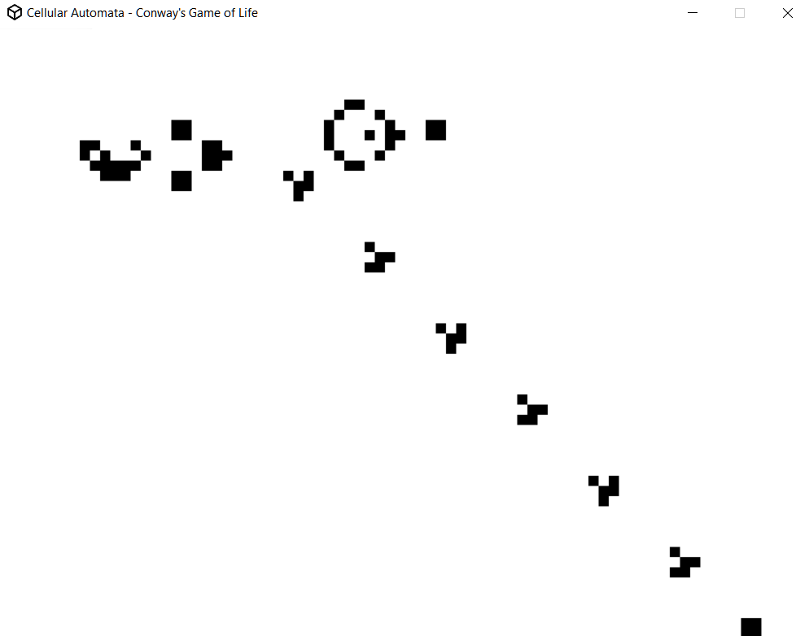

# Cellular Automaton Engine
An engine to help make cellular automata creation easy.

## Requirements
Lua 5

LÖVE 11.2 - https://love2d.org/

## Operation

Engine Controls
	
	ctrl: Toggle showing extra data
	
	spacebar or p: Toggle pause
		
	right or d: Step forward, update	
		
	s: Open save file prompt
		1. Enter filename
		2. Press enter to save, escape to quit
		3. Save filename = save_directory(set in conf.lua) .. filename entered

	drop file on window: load file
	
	
## Setting up a Game

1. Create a game file(use game_template.lua as template)

2. In engine.lua set import_filename = game_filename

3. Override any of the following values in game file

4. Use basic functionality from game_helper.lua by adding *require "game_helper"* at top of the game file

Setting defaults

	Engine.cell_size = 25
	
	Engine.states = {}

	function Engine:mousepressed(normalized_x, normalized_y, button) end
	
	function Engine:mousereleased(normalized_x, normalized_y, button) end
	
	function Engine:keypressed(key) end
	
	function Engine:keyreleased(key) end

	
### Engine Settings

-- In conf.lua

	update_delay: Delay in seconds between updates, false = No delay

	Engine.save_directory: Directory to save files to by default

-- In game file

	Engine.cell_size: Side length of cell

### Creating Cell States

All cell states are stored as tables in Engine.states.

Create state as so
	
	Engine.states[id] = {name="", color={255, 255, 255}, func=state_function}

Default state id = 1

State settings
	
	name='': Name of state
	
	color={255, 255, 255}: Color of state
	
	func=stay same state: Function to call on each cell of state, returns new state

	
### Adding Functionality 

Can add state functionality or UI functionality. 

Below is a list of all engine variables & functions to interact with, past that is function templates

Variables
	
	Engine.cells = {{number}}  -- Table of columns of cell states

	Engine.update_delay = seconds  -- Delay inbetween updates
	
	paused = bool  -- If game is paused

	player_pause = bool  -- If player command triggered pause, refocusing game wont trigger change

	show_data = bool  -- Whether or not to show cell data
	
	save_prompt = bool  -- Whether save prompt is showing or not
	
	get_text_intput = bool  -- Whether or not to enable text input controls
	
	input_buffer = ""  -- For logging text input when get_text_intput is true

	last_time = love.timer.getTime()  -- Last update time(seconds)

	
Functions

	Engine:create_cells()  -- Create new, empty cell matrix
	
	Engine:update_states()  -- Update all cell states on matrix
	
	Engine:get_color(state)  -- Get color associated with specific state
	
	Engine:show_data()  -- Shows various game data in top
	
	Engine:normalize_coords(x, y)  -- Converts screen pos coords to cell matrix indices
	
	Engine:load_file(filename)  -- Load old cell matrix
	
	Engine:save_file(filename)  -- Save current cell matrix
	
	Engine:start_save_prompt()  -- Starts prompt for entering save name, then saves if can
	

#### State Function Templates

Set a state function in its table with func=state_function

	function state_function(x, y, cell_matrix)
	
	   --------------------------------------------------
	   -- Update command for all cells of state
	   -- @param {number} x X coord of cell
	   -- @param {number} y Y coord of cell
	   -- @param {table{table{number}}} cell_matrix 2d matrix of cell states
	   -- @returns {number} New cell state
	   --------------------------------------------------
	
	   return new_state_id 
	end

	
#### User Control Function Templates

On Mouse Click

	function Engine:mousepressed(normalized_x, normalized_y, button)
	   --------------------------------------------------
	   -- Action to take on click
	   -- @param {number} normalized_x Normalized x pos of mouse
	   -- @param {number} normalized_y Normalized y pos of mouse
	   -- @param {left=1, right=2, middle=3} button Mouse button pressed
	   --------------------------------------------------
   
	   return nil
	end

On Mouse Unclick

	function Engine:mousereleased(normalized_x, normalized_y, button)
	   --------------------------------------------------
	   -- Action to take on unclick
	   -- @param {number} normalized_x Normalized x pos of mouse
	   -- @param {number} normalized_y Normalized y pos of mouse
	   -- @param {left=1, right=2, middle=3} button Mouse button released
	   --------------------------------------------------
	   
	   return nil
	end
	
On Keypress

	function Engine:keypress(key)
	   --------------------------------------------------
	   -- On key press take action
	   -- @param {love keyconstant} key Keyboard key pressed
	   --------------------------------------------------
	   
	   return nil
	end

On Keyrelease

	function Engine:keyreleased(key)
	   --------------------------------------------------
	   -- On key release take action
	   -- @param {love keyconstant} key Keyboard key released
	   --------------------------------------------------
	   
	   return nil
	end

## 
Cole Dieckhaus - csdhv9@mst.edu
